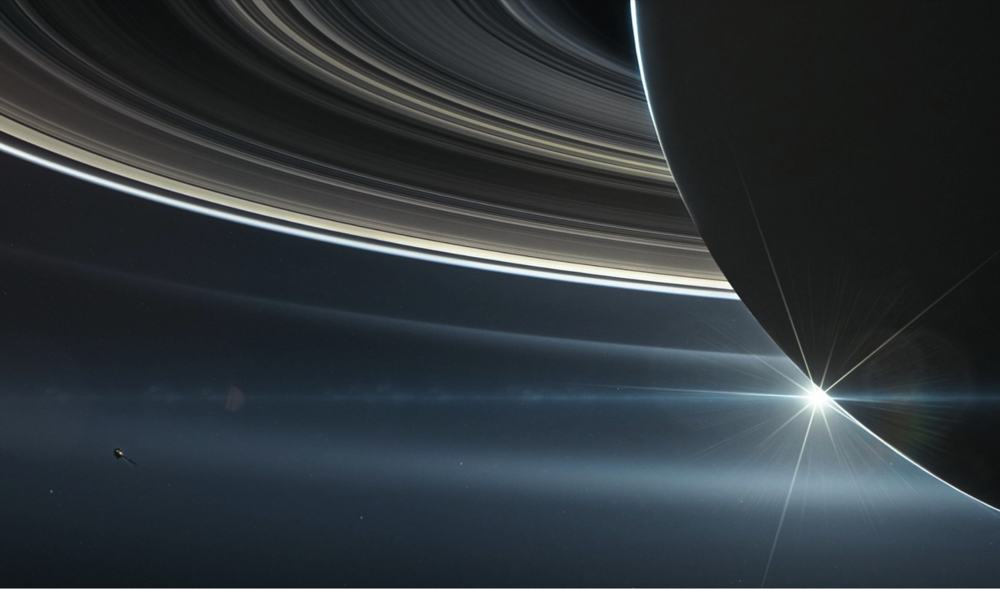

I am a PhD candidate within the University of Michigan's Climate and Space Sciences and Engineering department. I work on the development of automated methods to analyze large amounts of in-situ and remote sensing data to answer fundamental questions about planetary systems. I am passionate about applying data science techniques for scientific discovery in space and planetary sciences targeting large data and supervised classification tasks. Previously, I worked in science policy where I provided policy analysis and technical support to federal agencies on a variety of topics including climate data, STEM education, and space policy.  

## Research Interests

In 2004 the Cassini spacecraft arrived at Saturn. For the next 13 years the mission collected large amounts of data, resulting in a highly sampled environment and magnetic environment or magnetosphere of Saturn. Due to Cassini, Saturn is now the second most observed magnetosphere after that of Earth. Since the Cassini mission, many of our previous expectations about the Saturn environment have been overturned, from the role the largest moon Titan plays in the system to the rotational rate of the planet itself. 

*Image Source: Artistic interpretation of Cassini's final moments, sourced from [NASA](https://solarsystem.nasa.gov/missions/cassini/mission/grand-finale/overview/). Click [here](https://solarsystem.nasa.gov/resources/17728/cassinis-final-plunge/) to see an artistic interpretation from NASA on Cassini's final descent.*

My PhD thesis is on characterization and identification of the transport of energetic material in the environment around Saturn. These are called interchange injections and are similar to a Rayleigh - Taylor instability which are seen in fusion reactors and nebula. Researching these processes greatly improves knowledge of planetary magnetospheres and contributes to comparative studies of potentially habitable planets and [space weather risks](https://spaceplace.nasa.gov/spaceweather/en/) at Earth.

