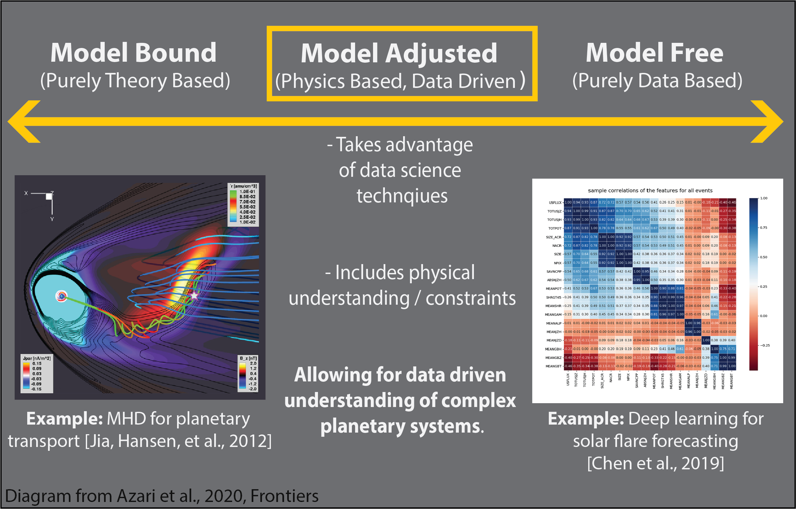

- [Interpretable Machine Learning Methods for Planetary Science](#interpretable-machine-learning-methods-for-planetary-science)
- [Saturn's Magnetospheric Transport](#saturns-magnetospheric-transport)
- [The Evolution of Mars' Magnetic Field](#the-evolution-of-mars-magnetic-field)

&nbsp;

&nbsp;

&nbsp;

&nbsp;

### Interpretable Machine Learning Methods for Planetary Science

A surge of data-rich planetary missions have transformed our ability to understand large and complicated plaentary systems. Automated methods are advantageous in analyzing these data and managing spacecraft to outer planetary bodies and are quickly becoming necessary to handle the large-data sizes being returned. A major use of automation in the field, is for scientific analyses, in which our understanding of the automation process itself is of critical importance. In addition, planetary science data themselves pose challenges to off the shelf applications of machine learning. I'm interested in developing interpretable methods to address data challenges through integration of physical understanding into machine learning pipelines.      

 

 <em> A diagram demonstrating a path toward creating understanding methods in automation for scientific discovery. Figure sourced from <a href="https://www.frontiersin.org/articles/10.3389/fspas.2020.00036/full">Azari et al., 2020 (Frontiers)</a>. Contains examples from <a href="https://doi.org/10.1029/2012JA017575">Jia, Hansen et al., 2012 (JGR Space Physics)</a> of a MHD physics-based model for Saturn's mass transport, and <a href=" https://doi.org/10.1029/2019SW002214">Chen et al., 2019 (Space Weather)</a> of deep learning for solar flare prediction. </em> 

### Saturn's Magnetospheric Transport

In 2004 the Cassini spacecraft arrived at Saturn. For the next 13 years the mission collected the largest ever, amount of data on Saturn's magnetic and space environment (magnetosphere). Due to Cassini, Saturn is now the second most observed magnetosphere after that of Earth and many of our previous expectations about the Saturn environment have been overturned from this data deluge. These unique datasets allow for the first large-scale statistical analyses of how mass moves around Saturn. It is now understood that a Rayleigh-Taylor (RT) like instabilities, called interchange, are instrumental in these processes by exchanging different plasma populations around Saturn. Saturn, and other giant magnetospheres, provide some of the best observations of these instabilities in a naturally evolving system allowing important studies that help fill in our understanding of transport around planetary bodies. 

 

 <em> Artistic interpretation of a middle-magnetosphere mass transport system at Saturn built from observations and data in <a href="http://hdl.handle.net/2027.42/155251">Azari 2020 (PhD Thesis)</a>. This mock up demonstrates an asymmetry in day and night side of the planet for high-energy plasma transport, with more frequent events injections of high energy material occuring on the night side of Saturn. Image developed in consulation with <a href="https://falconierivisuals.com/">Falconieri Visuals</a>. </em> 

### The Evolution of Mars' Magnetic Field

The Mars of several billion years ago is a very differnt Mars than that of today. Several billion years ago, Mars was geologically active from core to crust, possessed a much thicker atmosphere, and had an internally produced magnetic field. Today, the remnants of this former field remain, in effect frozen into the surface of Mars. A currently orbiting spacecraft, MAVEN, has obtained measurements above these fields; allowing for the large-scale characterization of these remnants to provide insight into to the historical evolution and eventual, termination, of Mars' formerly active field.   

 

 <em> Artist's impression of solar wind interaction with the current Mars space environment. Image courtesy of <a href="https://www.nasa.gov/press-release/nasa-mission-reveals-speed-of-solar-wind-stripping-martian-atmosphere/">NASA Goddard Space Flight Center.</a> </em> 

